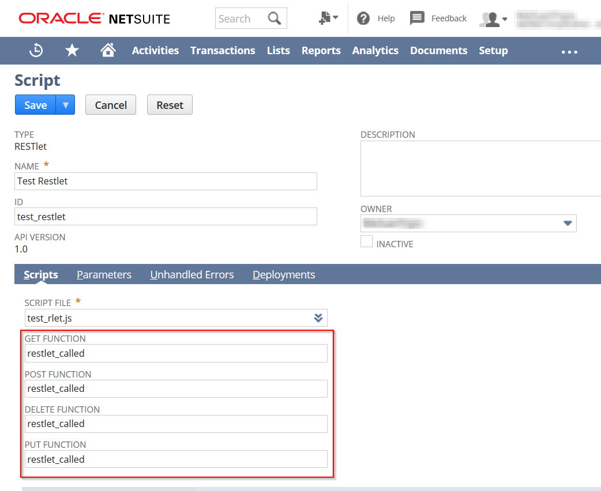

# Setting Up for NSRestlet Development

Hey there, and welcome.  I'm glad you want to take a look at the development of this module.

There are a few things you'll need to do to set up.

1.  Clone the repository using `git clone https://github.com/MichaelEPope/nsrestlet.git` to get a copy of all the code.

2.  Run `npm install`.  This will install the basic dependencies of the project.

3.  Run `npm install --only=dev`.  This will install the developer dependencies.

4.  Unfortunately, for testing we need to run a few global scripts.
Hopefully I can change this in the future.  For now, run:

* `npm install -g eslint`
* `npm install -g nyc`
* `npm install -g coveralls`

5.  Next, set up a Restlet in Netsuite.  Use the following code as the script file:

```javascript
function restlet_called(body)
{
    //used to simulate Netsuite dropping a request
    if(body.drop)
    {
        return {
            error:{
                code:"SSS_REQUEST_LIMIT_EXCEEDED",
                message:"Just testing to see if this works."
            }
        }
    }
    //used to simulate an unchaught error
    else if(body.throw)
    {
        throw new Error("testing123");
    }
    //used when we want to test returning a plain string
    else if(body.string)
    {
      return body.string;
    }
    //used when we want to test returning JSON
    else
    {
        return {
          success: true,
          data: body
        }
    }
}
```

6.  The Script Record should have `restlet_called()` as the method in all four method slots.



7.  Deploy the script.

8.  We need to set some environmental variables.  To do that, we need the following information:

* Account ID
* OAuth Token Key, Token Secret, Consumer Key, Consumer Secret
* Email, Password, and Role for a less privileged (doesn't require 2FA) account
* For the Restlet we just deployed, the URL, and Custom IDs for the Script and Deployment.

9.  Create a file called `.env` that looks like this:

```text
export ACCOUNT_ID=
export TOKEN_KEY=
export TOKEN_SECRET=
export CONSUMER_KEY=
export CONSUMER_SECRET=
export NON_PRIVELAGED_EMAIL=
export NON_PRIVELAGED_PASSWORD=
export NON_PRIVELAGED_ROLE=
export CUSTOMSCRIPT_STRING_ID=
export CUSTOMDEPLOY_STRING_ID=
export EXTERNAL_URL=
```

10.  Stick the information you got in step `8` into the `.env` file.

11. And that's it.  you're good to go!

Some things to keep in mind, if you'd like to contribute.

* I'd like to have 100% test coverage.
This means if you add things, write your own tests in `test.js`.
You can run the tests using `npm test`.
If there's a part of your code that can't be tested (because of hard to test conditions),
add the comment `/* istanbul ignore next */` above the line.

* While it's not as critical, run `eslint nsrestlet.js` to perform linting.
This is just nice to have, I'm not too strict on it.

* If possible, I want the code to be beginner friendly.
What I mean by that, is that a beginner should be able to read from the top to the bottom of a file, and understand what it does.
There are a few ways to do this:

1.  If possible, stick to ES5 code.  I know it's not always possible due to certain modules.
Just do your best.

2.  Add lots of comments.  Again, readable from top to bottom.

3.  Keep things sequential (because it keeps code understandable).  It's popular in JS to create sub-functions an modularize.
This sometimes makes the code difficult to understand though.  As an example, don't say
`I'm splitting the function because it's too large`, instead ask yourself
`would splitting the function here make sense to someone not familiar with the code?`
In other words, avoid spaghetti (no offense to that delicious meal of the same name).

Feel free to ask me any questions, though it may take me a few days to get back to you
(sorry, just a busy life).
