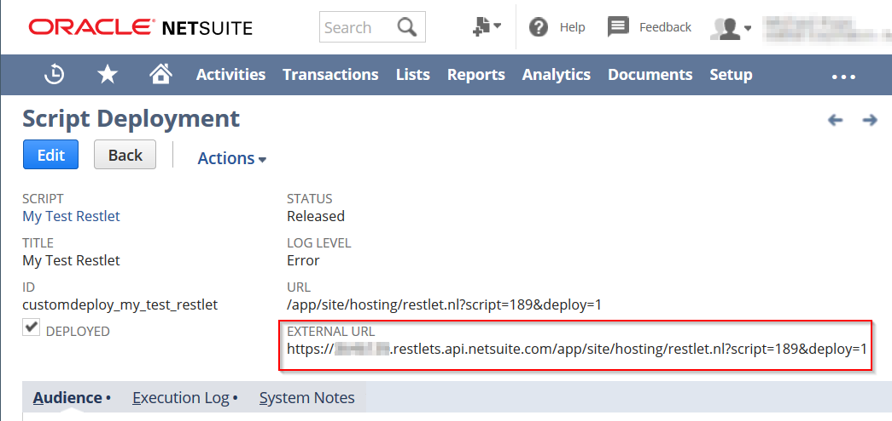
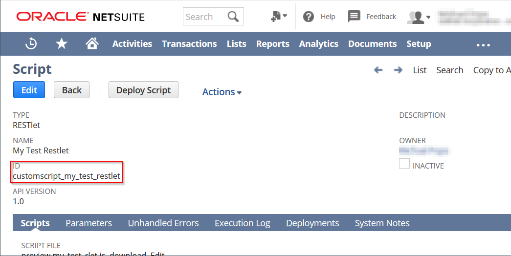
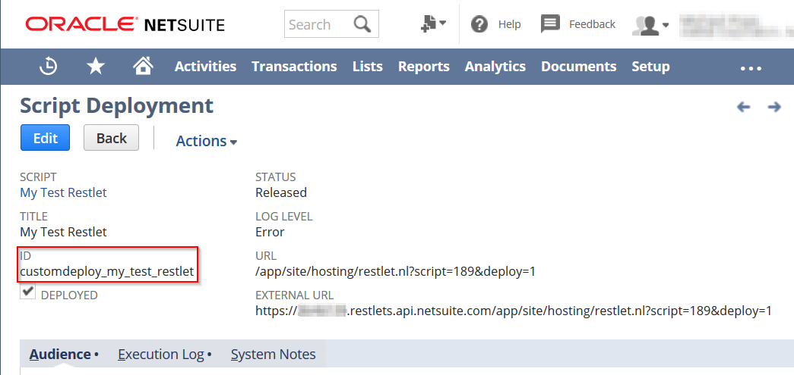

# NSRestlet

A module which makes connecting to Netsuite RESTlets using OAuth and NLAuth much easier.

[](https://nodei.co/npm/nsrestlet/)

[](https://snyk.io/test/github/MichaelEPope/nsrestlet?targetFile=package.json)
[](https://travis-ci.com/MichaelEPope/nsrestlet)
[](https://coveralls.io/github/MichaelEPope/nsrestlet?branch=master)
[](http://hits.dwyl.io/MichaelEPope/nsrestlet)

## Why NSRestlet?

Connecting to Netsuite RESTlets with external programs can be really hard.
* NLAuth has to deal with password changes and two factor authentication problems (which are required on high-permission accounts)
* OAuth is really hard to set up
* Netsuite errors for debugging NLAuth and OAuth applications are somewhat vauge
* The examples they have on SuiteAnswers don't always seem to work

This module will make your life easier.  It's as easy as:

```javascript
var nsrestlet = require('nsrestlet');

//For OAuth (we can do NLAuth too, see later in documentation):
var accountSettings = {
    accountId: "PUT YOUR ACCOUNT ID HERE",
    tokenKey: "PUT YOUR TOKEN KEY HERE",
    tokenSecret: "PUT YOUR TOKEN SECRET HERE",
    consumerKey: "PUT YOUR CONSUMER KEY HERE",
    consumerSecret: "PUT YOUR CONSUMER SECRET HERE" };
var urlSettings = {url: 'https://ACCOUNTID.restlets.api.netsuite.com/app/site/hosting/restlet.nl?script=SCRIPTID&deploy=DEPLOYID'}

//create a link
var myInvoices = nsrestlet.createLink(accountSettings, urlSettings)

//then call get, post, put, or delete
myInvoices.get({id: '12345'}, function(error, body)
{
    console.log(body);
});

```
That may look a bit intimidating, but trust me, it's not.  [Here is a tutorial on how to set up OAuth with Netsuite](./TUTORIAL.md), which makes things much easier, even if you aren't familiar with OAuth.

## Setting Things Up

Follow these four steps:

1.  [Read this tutorial](./TUTORIAL.md).  It contains instructions on how to set up your Netsuite environment for OAuth or NLAuth.

2.  [Install Node.JS](https://nodejs.org).  This module should work with any version that isn't too old (I test on Node.JS version 6 and it works fine).

3.  Open the command line and change your directory (using `````cd`````) to your project.

4.  Then run:

```
npm install nsrestlet
```

## Setting Up Account Settings

In order to create a connection to Netsuite, you need to provide some account settings.

For OAuth, the account settings will look like this:

`````js
//all fields are required
var accountSettings = {
    accountId: "PUT YOUR ACCOUNT ID HERE",
    tokenKey: "PUT YOUR TOKEN KEY HERE",
    tokenSecret: "PUT YOUR TOKEN SECRET HERE",
    consumerKey: "PUT YOUR CONSUMER KEY HERE",
    consumerSecret: "PUT YOUR CONSUMER SECRET HERE" }; 
`````
For NLAuth, the account settings look like this:

`````js
//all fields except role are required
var accountSettings = {
    accountId: "PUT YOUR ACCOUNT ID HERE",
    email: "PUT YOUR EMAIL HERE",
    password: "PUT YOUR PASSWORD HERE",
    role: "PUT YOUR ROLE KEY HERE" };   //optional, but reccomended
`````

## Setting Up URL Settings

You also need to provide some URL settings.  The URL settings can be formatted in one of two ways.

The first is by using a direct URL.  This is listed on the script deployment page in Netsuite as the **EXTERNAL URL** field:

`````js
var urlSettings = {
    url: "https://12345.restlets.api.netsuite.com/app/site/hosting/restlet.nl?script=1&deploy=1"
};
`````



The second way is to provide the script id and deployment id (either the string version or number version).  These can be found on the script and script deployment pages in Netsuite in the **ID** field:
`````js
//You can use the string version...
var urlSettings = {
    script: "customscript_test_restlet",
    deployment: "customdeploy_test_restlet"
}

//...or the number version
var urlSettings = {
    script: 142,
    deployment: 1
}
`````





## Creating a Link

Once you've created the account settings and url settings objects, pass them into `````nsrestlet.createLink()`````:

`````javascript
var invoice_link = nsrestlet.createLink(accountSettings, urlSettings);
`````

This link allows you to call a restlet endpoint in an easy, clean, and repeatable way.  It also allows you to reuse the account settings to connect to other restlets.

## Calling the Endpoint

Once you have a link, you can directly call the four basic HTTP methods (`````GET`````, `````POST`````, `````PUT`````, `````DELETE`````).

The first parameter you provide is the data which will be sent to the restlet.

The second parameter is an optional callback.  If not provided, a promise will be returned instead.  This callback or promise will receive data from your Netsuite Restlet.

`````javascript
//Callbacks work great...
invoice_link.get({tranid: 12345}, function(error, body)
{
    console.log(error, body);
});

//... and so do promises.
invoice_link.post({tranid: 12345}).then(function(body)
{
    console.log(body);
})
.catch(function(error)
{
    console.log(error);
});

//invoice_link also has .put() and .delete() methods
`````

## Receiving and Returning Data in the Restlet

Inside of your Restlet script in Netsuite, you will receive the data as the first parameter:

`````javascript
function restlet_called(body)
{
  //you recieve the payload as 'body'
  
  //if your application likes JSON, you can send data back to it like this:
  return {message: "I got your message", data: body}
  
  //...otherwise send it as a string using JSON.stringify()
}
`````

Or in Suitscript 2:
`````javascript
/**
 * @NApiVersion 2.x
 * @NScriptType Restlet
 */

define(['N/log'], 
    function(log) 
    {
        function restlet_called(body) 
        {
            //you recieve the payload as 'body'
  
            //if your application likes JSON, you can send data back to it like this:
            return {message: "I got your message", data: body}
  
            //...otherwise send it as a string using JSON.stringify()
        }
        return {
            get:    restlet_called,
	        post:   restlet_called,
            put:    restlet_called,
            delete: restlet_called
        };
});
`````

For `````GET`````, `````POST`````, and `````PUT````` requests, you can return data back to the external application.

This data will be provided in the callback or promise (depending on which you are using).

`````javascript
//for example as a callback
invoice_link.post({tranid:12345}, function(error, body)
{
    console.log(body);
    /*
        You'd see this printed out:
        
        { message: "I got your message",
          data: { tranid:12345 } }
    */
});
`````
For `````DELETE````` requests, you won't receive any data back, but you should still provide a callback or promise resolution to catch any errors that might occur.

## Error Handling and Endpoint Retries

Sometimes things go wrong when trying to call a Restlet, and an error is emitted.

In caess like rate limitng or dropped requests, `nsrestlet` will retry the call (by default up to three times) before emitting an error.

In other cases where retrying wouldn't make a difference, `nsrestlet` will emit an error immediately.

You can recieve this error in you callback (`````error````` paramater) or promise (`````.catch()`````).

You can customize the retry settings by adding some fields to the __URLSettings__ object.

`````javascript
var urlSettings = {
        script: 142,
        deployment: 1,
        retries: 5,     //specifies the number of retries, default is 3
        backoff: 120 }  //specifies the multiplicative backoff, default is 0
`````
The retries refers to the number of retries to perform on retryable errors.  Backoff refers to how many milliseconds to delay on a retryable error if a request fails.
The backoff is multiplicative, so each failure (in this case, 3 of them), will double the time delay (120, 240, 480 milliseconds).
This is a useful field if you're receiving rate limiting errors from Netsuite.

## Need more Customization?

[Here is some basic code you can start with.](https://stackoverflow.com/questions/50611578/netsuite-oauth-not-working/50651498)  It provides a good base for a custom solution.

## Want to help with Development?

Feel free.  Please see the [Development](./DEVELOPMENT.md) page to get started.

## Licensce

MIT (see LICENSE file).  But we love contributions and suggestions.  Please feel free to suggest improvements.

## Credits

This module was made after looking at a lot of good code.  Here is some the code that inspired this module and effected how it was designed:

* [bknight's](https://github.com/bknights) response in [this thread](https://stackoverflow.com/questions/50611578/netsuite-oauth-not-working/50651498) is excellent - the idea of a facade for four HTTP codes works really well.  The error handling and retrying capabilities also comes from looking at his code.  He was generous enough to post a full example of what was working on his end.
* [suiteplus](https://github.com/suiteplus) has an excellent module called [nscabinet](https://github.com/suiteplus/nscabinet), which helps upload and download files from Netsuite as a gulp task.  Reading through it helped me understand how to use the `````querystring````` module and NLAuth.
* Marty Zigman has a [good sample](http://blog.prolecto.com/2017/10/14/download-netsuite-oauth-token-based-authentication-sample-node-js-program/) that got me pointed in the right direction.
* These excellent modules are used in this project -   [request](https://www.npmjs.com/package/request), [oauth-1.0a](https://www.npmjs.com/package/oauth-1.0a), and [qs](https://www.npmjs.com/package/qs).

## Version Changes

Please see the [Changelog](./CHANGELOG.md)
