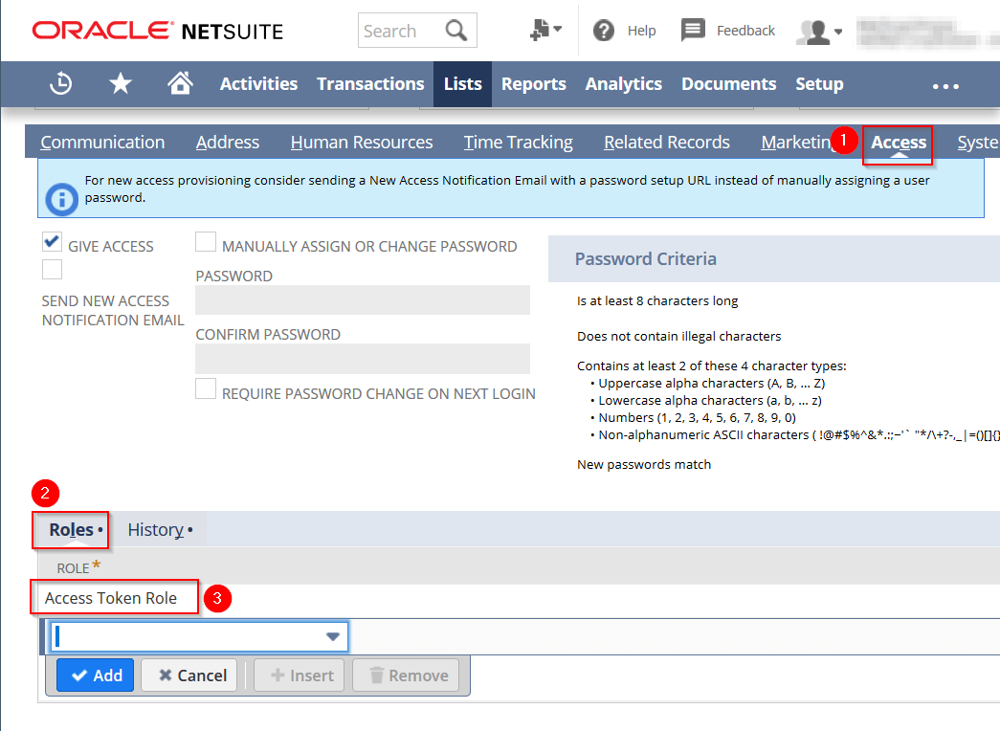
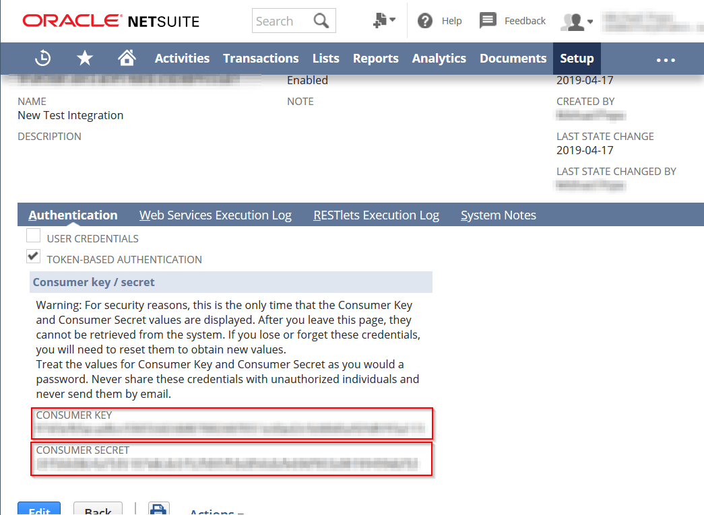

# Setting Up Netsuite Restlets

This tutorial will show you the steps you need to take to set up your Netsuite account so that external program can communicate with it via Restlets.

## OAuth v NLAuth

There are two ways to sign in to Netsuite using external applications.

The first way is called NLAuth.  You provide your `Username`, `Password`, and `Account ID` so your application can communicate with Netsuite.  The advantages of using NLAuth are:

1.  It's easy to set up.  Chances are you're already set up for it.

2.  It's familiar, because you use a username and password format.

There are some disadvantages to that though.

1. You are providing a password to an application.  If the application is going to be used outside of a secure environment, this method doesn't work well.

2.  Unless you turn the option off, Netsuite will require you to change that password every six months.  You'll need to change the password your applications use because of that.

3.  Applications don't work very well with 2FA (two factor authentication).  This is required for Administrator and other High-Privilege roles, so you can't use them with NLAuth at all.

OAuth on the other hand, works entirely differently.  Instead, you generate a set of `keys` and `secrets` that you give to an application that let it sign into Netsuite with a specific account and role.

OAuth solves all of the disadvantages of NLAuth.

1.  It's easy to remove a `key` and `secret` set that has been compromised and generate a new one, so you can use these in any environment.  Furthermore, these keys don't provide any access to login to Netsuite's website.

2.  OAuth tokens don't need to be changed out every few months.

3.  OAuth tokens bypass the need for 2FA.

It's a bit more difficult to implement, but if you follow this tutorial and use `nsrestlet`, it should be really easy.

## Enabling Netsuite Settings

First, we need to enable Suitescript.

1. Go to __Setup__ -> __Company__ -> __SuiteCloud__.

2. Enable __Client Suitescript__, and then __Server Suitescript__.

3. You need your __Account ID__.  Go to __Setup__ -> __Integrations__ -> __Web Services Preferences__, and look at the __Account ID__ field.  Copy that number down somewhere.


At this point, you'll need to choose either NLAuth or OAuth.

If running NLAuth, you already have the `email` and `password` you'll need.  You'll also need your `role number`:

4. You can get that by going to __Setup__ -> __Users/Roles__ -> __Manage Roles__ and looking up your role number (Administrator isn't listed, but for me it's 3).  You can then jump down to later in this tutorial where we build the actual __RESTlet__.


If you're setting up OAuth, please continue with these steps instead:

4. Scroll down to __Manage Authentication__ section and enable __Token-Based Authentication__

5. We need to create a role that is OAuth enabled (Administrator is not so you'll need to create a new role).  Go to __Setup__ -> __Users/Roles__ -> __Manage Roles__ -> __New__

6. Give the role a Name.

7. In the sublists, go to __Permissions__ -> __Setup__.

8.  Add the Permissions __Access Token Management__, __Log in using Access Tokens__, and __User Access Tokens__.  Then save.


9. We need to add this role to a user (I suggest adding it to yourself if you are testing an application you are making).  Use __Setup__ -> __Users/Roles__ -> __Manage Users__ to find the User you wish to add the role to.  Click edit.

10. In the sublists, go to __Access__ -> __Roles__ and add the role you just created to the user.  You may also need to check __Give Access__ right above that (haven't verified yet).  Then click save.



11. We now need to set up an integration.  Go to __Setup__ -> __Integrations__ -> __Manage Integrations__ -> __New__.

12.  Give your integration a Name and Description.  The integration represents your application to Netsuite.  Make sure to enable __Token Based Authentication__ in the __Authentication__ subtab (you may want to disable __User Credentials__ as well).  Click Save.

13. The `Consumer Key` and `Consumer Secret` will display.  Copy these somewhere safe.  You will need them for your application and will not be able to access them again once you navigate away from this page (you can always generate new ones though).



14. We now need to set up a token.  Go to __Setup__ -> __Users/Roles__ -> __Access Tokens__ -> __New__.

15. For __Application Name__, select the Integration you just created, along with the user and role you selected earlier.  You can also rename the token if you'd like.  The Token will represent the specified user and role to Netsuite.  Once you're done, click Save.

16. The `Token Key` (also known as the Token ID) and `Token Secret` will display.  Copy these somewhere safe.  You will need them for your application and will not be able to access them again once you navigate away from this page (you can always generate new ones though).


Once you have your __Account ID__, `Consumer Key`, `Consumer Secret`, `Token Key`, and `Token Secret` Netsuite is all set up.  You can move on to making a Restlet to communicate to.

## A Simple Restlet Sample

You'll need to set up a testing restlet to try your requests against.  Here are the steps to do so:

1. Go to __Customization__ -> __Scripting__ -> __Scripts__ -> __New__.

Netsuite changes the process for setting up scripts occasionally, so these steps may be a bit different for you.  On my account the steps are:

2. Enter in the name of a script file (or click the + button to upload one from the new computer) and then click __Create Script Record__.  Here's the code that should be in that file:

`````javascript
function restlet_called(body)
{
    //you recieve the payload as 'body'
    nlapiLogExecution("debug", "test", JSON.stringify(body))
  
    return {
        message: "I got your message",
        data: body
    }

}
`````

3. Select a __RESTlet__ script

4. Give the script a name and id.

5. In the files for the __GET__, __POST__, __PUT__, and __DELETE__ functions, type in  __restlet_called__ (this is the function name)


6. Click Save.

7.  At the top of the page, click the __Deploy Script__ button.

9.  Enter in a Title and ID.  Change the status to Released and the Log Level to Debug.  Finally, assign the roles and users you wish to access the Restlet.  Make sure to include the role and user you have OAuth or NLAuth information for.


10.  Click Save.

11.  You will need the __External URL__ field.  Copy this down for use later.


And that's it.  You should be set up and ready to go.  Why don't you go take a look at this module and see how you can integrate it into an application.